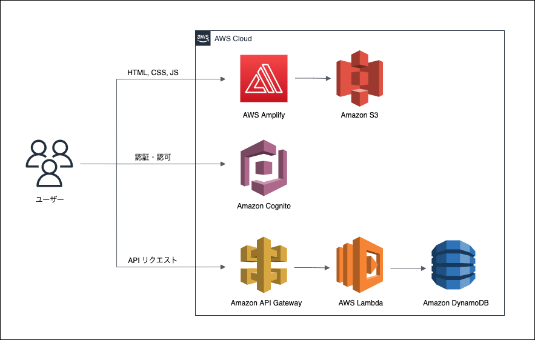
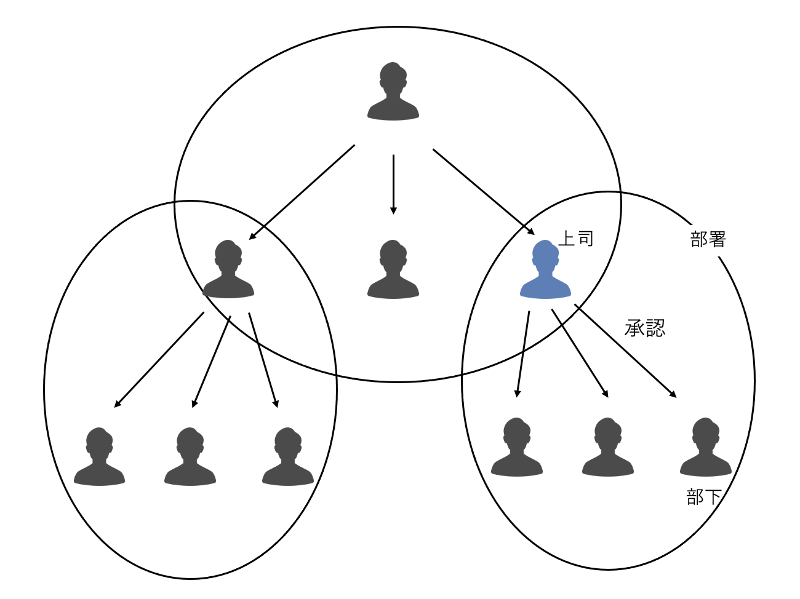
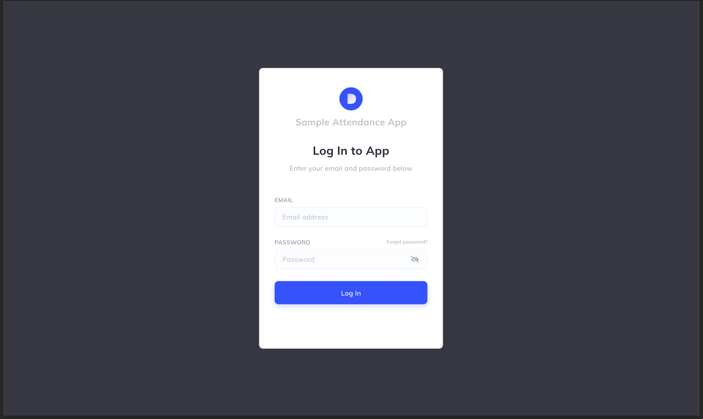
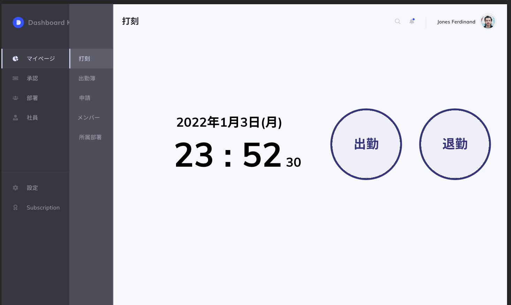
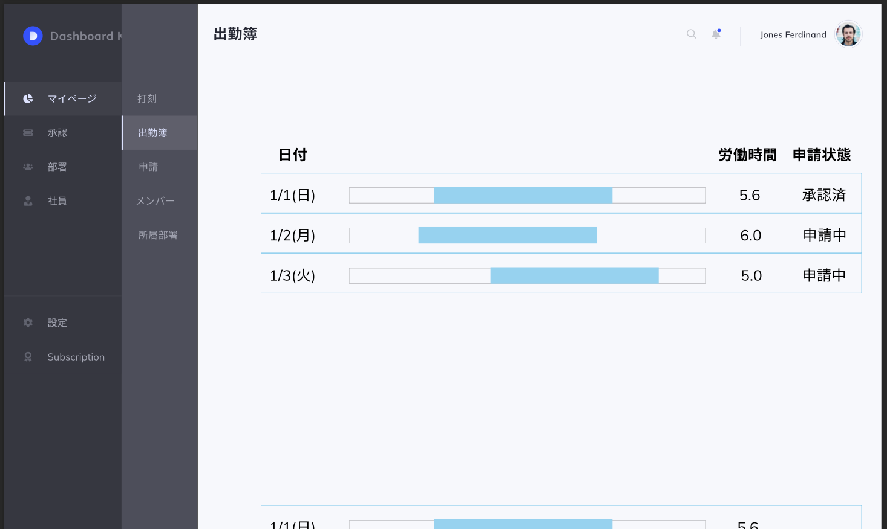
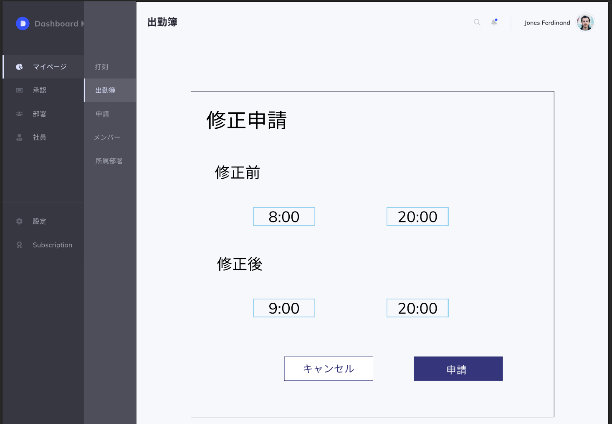

# attendance_app
AWSで作ってみた勤怠管理アプリ

## アーキテクチャ
- AWSを使ったサーバーレスWebアプリ
- 簡単にしたいのでAPI Gatewayとlambdaを使用

- 構成図作成サイト：https://app.diagrams.net/

## 要件
- 打刻
  - マイページの打刻ページから
  - 休憩はとりあえずなしで、出勤と退勤のみ
- 承認申請、修正申請
  - 上司に申請を要求、部下の申請を承認/修正要請
- グルーピング
  - グループの中で承認する/されるユーザーを定義する

## 画面デザイン

## モデル設計
dynamoDBのベストプラクティスは難しいから、RDB的な設計にする 
データ数が少ないのでN+1問題は無視

### Attendanceモデルのstatus

## 使用したReactライブラリ
- サイドバー：[react-pro-sidebar](https://github.com/azouaoui-med/react-pro-sidebar)
- ヘッダー：[material-ui AppBar](https://mui.com/components/app-bar/)
- ルーティング：[react-router-dom](https://v5.reactrouter.com/web/guides/quick-start)
